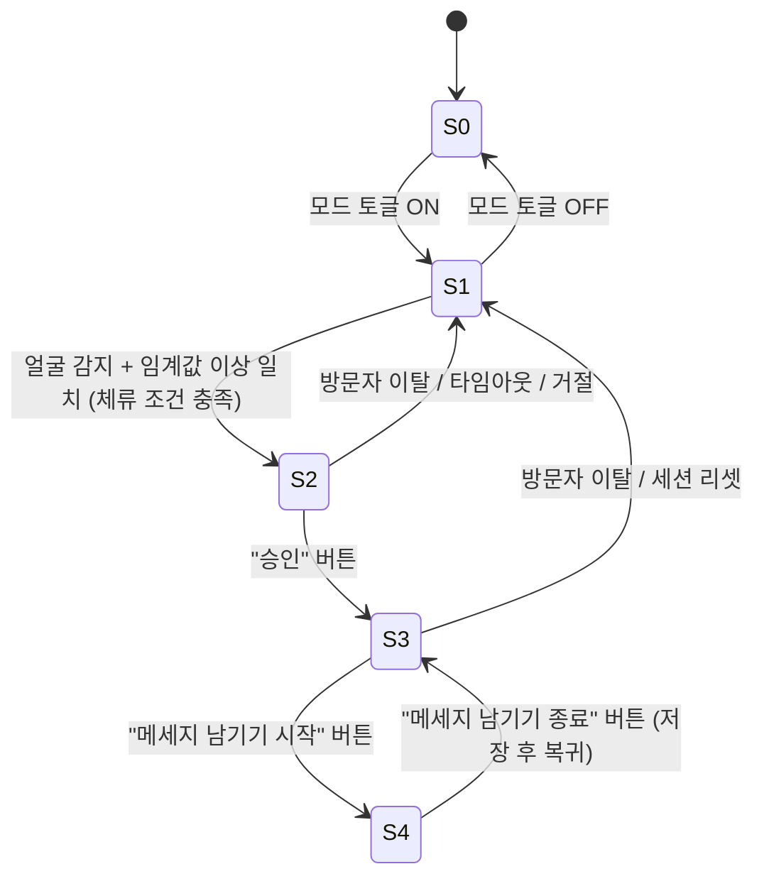

# 자동식별 기반 추모(기념) 앨범 인터랙션 기능 명세서

## 0. 이 문서에 대하여
본 문서는 아래 사용자 시나리오를, 코드 에이전트가 정확히 이해하고 구현 계획(아키텍처, 모듈 분할, 데이터 흐름, 상태 관리)을 수립할 수 있도록 **동작(behavior) 수준**에서 구체화한 명세이다.

- 기술 스택(언어/프레임워크/라이브러리/저장소 종류/모델 종류)은 **지정하지 않는다.**
- 대신 "필요 능력(capability)"을 추상적으로 정의하고, 각 단계에서 "무엇이 입력되고, 어떻게 처리되며, 무엇이 출력/저장/전이되는가"만 규정한다.
- 구현자가 반드시 결정해야 하는 파라미터/정책은 9장에 모아둔다.

---

## 1. 기능 개요
자동식별 모드가 켜진 상태에서 시스템은 웹캠 영상을 지속적으로 감시한다. 사람 얼굴이 들어오면 안면인식으로 "앨범 주인이 사전 등록한 인물 목록"과 대조한다. 일치하는 인물이 있으면 중앙 gravestone 영역에 그 인물의 이름·얼굴과 함께 인사/안내 문구를 띄운다. 사용자가 버튼으로 승인하면, 배경을 채우는 미디어와 중앙 슬라이드쇼를 "인식된 인물과 앨범 주인이 함께 등장한 미디어"로 한정해 필터링한다. 이 시점부터 "메세지 남기기" 기능이 활성화되며, 사용자가 버튼으로 시작하면 마이크 음성을 음성인식으로 받아 메세지로 저장하고, 사용자가 버튼으로 명시적으로 종료한다. 저장되는 메세지는 작성자(인식된 인물)와 내용이 함께 앨범의 연관 데이터로 기록된다.

---

## 2. 용어 및 핵심 엔티티
- **앨범 주인(Album Owner)**: 이 앨범/추모 공간의 중심 인물(피추모자). 시스템 내에서 단일하게 식별되는 특수 인물이며, "함께 등장" 판정의 한 축이 된다. 미디어가 앨범 주인의 등장 여부를 판별할 수 있어야 하므로, 앨범 주인 역시 인식 기준 데이터(얼굴 기준치) 또는 미디어 태깅 정보를 통해 식별 가능해야 한다.
- **등록 인물(Registered Person)**: 앨범 주인이 사전에 등록한 사람들. 각 등록 인물은 최소한 **이름**과 **안면 기준 데이터**(매칭에 쓰일 얼굴 정보)를 가진다.
- **방문자(Visitor)**: 현재 웹캠 앞에 있는 사람. 등록 인물 목록과 대조되어 일치 여부가 판정된다. 일치하면 그 사람은 "**인식된 인물**(= 특정 등록 인물)"이 된다.
- **미디어(Media Item)**: 배경과 중앙 슬라이드쇼를 구성하는 사진/영상 등. 각 미디어는 "어떤 인물들이 등장하는지(앨범 주인 포함)"를 알 수 있어야 한다(사전 태깅 또는 인식으로 도출).
- **인물 출현 정보(Appearance Tag)**: 미디어별로 그 안에 등장하는 인물 집합. "함께 등장" 필터링과 n 계산의 기반.
- **메세지(Message)**: 작성자(인식된 인물), 내용(텍스트), 소속 앨범(연관), 생성 시각 등을 담는 데이터.
- **자동식별 모드(Auto-ID Mode)**: 켜짐/꺼짐 토글.
- **gravestone 영역**: 인사/안내 문구, 인식된 인물의 이름·얼굴, 그리고 필터링된 미디어의 슬라이드쇼가 표시되는 중앙 영역.
- **배경 미디어 영역(Background Media)**: 화면 뒤편을 구성하는 미디어 표시 영역.

> **핵심 의존성 강조**: "n장 찾기"와 "함께 나온 미디어 필터링"이 성립하려면, 시스템은 **임의의 미디어에 (a) 특정 인물과 (b) 앨범 주인이 각각 등장하는지**를 판정할 수 있어야 한다. 이는 미디어에 인물 태그가 사전 부여되어 있거나, 미디어에 대한 인식이 가능해야 함을 의미한다. 구현 계획 수립 시 이 데이터가 어디서 오는지를 가장 먼저 확정할 것.

---

## 3. 필요 능력 (구현 수단 미지정)
구현자는 아래 능력을 임의의 적절한 수단으로 충족한다. 특정 라이브러리/모델/DB를 강제하지 않는다.

- **C1 카메라 스트림 취득**: 웹캠의 실시간 영상 프레임에 접근.
- **C2 얼굴 감지**: 프레임 내 사람 얼굴의 존재/위치를 검출.
- **C3 안면 인식/매칭**: 감지된 얼굴을 등록 인물의 안면 기준 데이터와 대조하여 "일치 후보 + 신뢰도(점수)"를 산출하고, 임계값 이상일 때만 일치로 간주.
- **C4 미디어–인물 출현 판정**: 임의 미디어에 특정 인물(및 앨범 주인)이 등장하는지 판정/조회. 사전 태깅 데이터 또는 미디어에 대한 인식으로 충족 가능.
- **C5 마이크 스트림 취득**: 실시간 오디오 입력 접근.
- **C6 음성 인식(STT)**: 오디오를 텍스트로 변환(가능하면 중간 인식 결과 포함).
- **C7 영속 저장**: 등록 인물, 미디어+출현 태그, 메세지를 저장/조회.
- **C8 UI 표시/입력**: gravestone 영역·배경 영역의 갱신, 버튼 입력 수신.

### 3.1 안면인식 구현 권고 (검증된 API/SDK 사용)
얼굴 감지·인식(C2, C3) 및 미디어 인물 태깅(C4)은 **자체 모델을 새로 구현하지 말고, 외부에서 검증된 상용/공개 안면인식 API 또는 SDK를 사용할 것을 강력히 권고한다.** 본 명세는 특정 벤더/제품을 지정하지 않으며, 선택한 솔루션이 아래 "검증" 기준을 충족하기만 하면 된다(이는 구성요소의 품질·동작에 대한 제약일 뿐, 특정 구현 수단의 강제가 아니다).

**권고 사유**: 인식 정확도가 사용자 경험을 직접 좌우하고, 추모라는 맥락에서 오인식/누락의 부작용이 크며, 얼굴이라는 생체정보 취급에 따른 보안·프라이버시·공정성 리스크가 크기 때문이다. 또한 입력이 실시간 웹캠이고 이 앱 자체가 인물의 사진/영상을 화면에 표시하므로, **사진·영상을 카메라에 들이대는 위조(presentation attack)** 에 의한 오인식 위험이 실재한다.

**"검증된(verified)" 솔루션의 판단 기준:**
- **독립 평가 실적**: 제3자 독립 평가에 참여하여 공개된 정확도 결과가 있을 것. 대표 예로 NIST의 얼굴기술 평가 — 신원 인식은 **FRTE**(Face Recognition Technology Evaluation; 1:1 검증, 1:N 식별), 이미지 분석은 **FATE**(Face Analysis Technology Evaluation; 위조 공격 탐지·품질 등), 과거 명칭은 **FRVT** — 에서의 성능 보고를 참고 지표로 삼는다.
- **위조 공격 탐지/라이브니스(PAD, anti-spoofing)**: 실시간 캡처 경로(C2/C3)에서 사진·영상 재생 등 제시 공격을 식별할 수 있을 것. (정적 미디어 태깅 C4에는 해당하지 않을 수 있음)
- **인구통계학적 공정성**: 연령·성별·인종 등 집단 간 인식 오차(편향)에 대한 측정/보고가 있을 것.
- **프라이버시·데이터 취급**: 얼굴 임베딩 등 생체정보의 저장·전송·보존·삭제 정책이 문서화되어 있고, 동의/규제 준수와 데이터 처리 위치(온디바이스 처리 또는 데이터 레지던시) 선택이 가능할 것.
- **운영 신뢰성**: 지속적 보안 업데이트, 안정적 가용성(SLA)·기술 지원이 제공될 것.

**적용 메모**: C2·C3·C4는 동일 제공자로 한 번에 충족하거나 서로 다른 제공자로 분리 충족할 수 있다. 어느 경우든 위 기준의 충족 여부를 구현 계획 단계에서 검토·문서화한다. 자체 구현은 위 기준을 동등하게 입증할 수 있을 때에 한해 예외적으로 고려한다.

---

## 4. 화면 영역과 컨트롤
- **gravestone 영역(중앙)**: 상태에 따라 (a) 인식된 인물의 이름·얼굴 + 인사/안내 문구, 또는 (b) 필터링된 미디어 슬라이드쇼를 표시.
- **배경 미디어 영역**: 기본 상태에서는 기본 미디어 집합(예: 전체 또는 사전 정의 집합)을, 승인 후 필터링 상태에서는 교집합 미디어만 표시.
- **컨트롤(버튼)**: 자동식별 모드 토글, "확인/승인", "메세지 남기기 시작", "메세지 남기기 종료". (승인 거절/취소 버튼의 존재 여부는 9장 결정 항목)

---

## 5. 상태 모델

### 상태 목록
- **S0 모드 꺼짐(DISABLED)**: 감시하지 않음.
- **S1 감시 중(MONITORING)**: 자동식별 모드 ON, 얼굴 탐색 중. 표시는 기본 상태.
- **S2 인식·안내(RECOGNIZED_PROMPT)**: 일치 인물 확정. 인사/안내 문구 + 이름·얼굴 표시. 승인 대기.
- **S3 필터 뷰(FILTERED_VIEW)**: 승인 완료. 배경/중앙 슬라이드쇼가 교집합 미디어로 한정. "메세지 남기기" 활성.
- **S4 메세지 녹음(MESSAGE_RECORDING)**: 마이크 ON, 음성 인식 진행. 종료 버튼 대기.

### 전이 다이어그램

### 전이 트리거 요약
- S0 → S1: 모드 ON / S1 → S0: 모드 OFF
- S1 → S2: 얼굴 감지 + 임계값 이상 일치 인물 확정 + 안정화(체류) 조건 충족
- S2 → S3: 사용자 "승인" 버튼
- S2 → S1: 승인 전 이탈 / 타임아웃 / 거절(정책에 따름)
- S3 → S4: "메세지 남기기 시작" 버튼
- S4 → S3: "메세지 남기기 종료" 버튼(저장 후)
- 임의 상태 → S1/S0: 방문자 이탈, 모드 OFF, 리셋 조건 충족(9장)

---

## 6. 단계별 동작 상세

### 6.1 자동식별 모드 토글
- **트리거**: 모드 토글 버튼.
- **ON**: S1 진입, C1 카메라 스트림 및 C2 얼굴 감지 루프 시작.
- **OFF**: S0 진입, 감지/인식/녹음 등 진행 중 작업을 모두 중단하고 gravestone/배경을 기본 상태로 복귀.

### 6.2 얼굴 감지 (S1)
- **처리**: C2로 프레임에서 얼굴 존재 여부 판정.
- **얼굴 없음**: S1 유지(기본 표시).
- **얼굴 있음**: C3 인식 단계로 진행. 다중 얼굴 시 대상 선택 정책 필요(9장; 예: 가장 크게/가깝게 잡힌 얼굴 1인).
- **안정화**: 순간적 스침으로 인한 오작동을 막기 위해, 일정 시간/연속 프레임 동안 얼굴이 유지될 때만 다음 단계로 진행(체류 조건, 9장).

### 6.3 안면 인식/매칭 (S1 → S2)
- **처리**: C3로 감지 얼굴을 등록 인물들과 대조하여 최고 신뢰도 후보와 점수를 산출.
- **점수 ≥ 임계값**: 해당 등록 인물을 "인식된 인물"로 확정 → 6.4로 진행.
- **점수 < 임계값(미등록/불확실)**: 일치 없음으로 처리. 인사/안내를 띄우지 않고 S1 유지(또는 정책상 별도 안내; 9장).
- **재인식 억제**: 같은 인물이 계속 보이는 동안 S2를 반복 재트리거하지 않음(디바운스).

### 6.4 인사/안내 표시 및 n 계산 (S2)
- **n 계산**: C4로 "인식된 인물과 앨범 주인이 **함께** 등장한 미디어"의 개수 n을 산출(= 교집합 집합의 크기). 이 교집합 집합 자체는 이후 필터링에서 재사용하므로 보관한다.
- **표시**: gravestone 영역에 인식된 인물의 이름·얼굴과 함께 아래 형식의 안내를 표시.
  > 안녕하세요, **{이름}**님.
  > {이름}님과의 추억을 담은 기록을 **{n}**장 찾았어요. 확인하시겠어요?
- **대기**: "승인" 버튼 입력 대기.
- **n = 0 처리**(공유 기록 없음)는 결정 항목(9장: 예 — 다른 문구 표시 / 진행 차단).

### 6.5 사용자 승인 (S2 → S3)
- **트리거**: "승인/확인" 버튼.
- **처리**: 6.4에서 산출·보관한 교집합 미디어 집합을 "현재 필터 집합"으로 확정.
- **미승인 경로**: 버튼 미입력 상태에서 방문자 이탈/타임아웃 → 세션 리셋(S1). 거절 버튼 제공 여부는 9장.

### 6.6 미디어 필터링 (S3)
- **배경 미디어 영역**: 표시 대상을 "현재 필터 집합"으로 한정.
- **gravestone 중앙 슬라이드쇼**: 슬라이드쇼 소스를 동일한 "현재 필터 집합"으로 한정하여 순환 재생.
- 두 영역 **모두** 교집합 외 미디어는 노출되지 않아야 한다.

### 6.7 메세지 남기기 활성화 (S3)
- S3에 진입한 시점부터 "메세지 남기기 시작" 버튼이 활성화/노출된다.
- S0~S2에서는 비활성 상태로 유지.

### 6.8 메세지 녹음 — 음성 인식 (S3 → S4)
- **트리거**: "메세지 남기기 시작" 버튼.
- **처리**: C5 마이크 입력 시작, C6 음성 인식으로 사용자의 발화를 텍스트로 변환. (중간 인식 결과의 실시간 표시 여부는 9장)
- **진행 표시**: 녹음/인식 중임을 사용자가 인지할 수 있도록 상태 인디케이터 표시.

### 6.9 메세지 종료 및 저장 (S4 → S3)
- **트리거**: "메세지 남기기 종료" 버튼. **명시적 종료가 반드시 가능해야 한다.**
- **처리**: 마이크 입력 종료, 최종 인식 텍스트 확정.
- **저장**: 메세지를 다음 정보와 함께 영속 저장(C7)하고 해당 앨범의 **연관 데이터**로 기록한다.
  - **작성자**: 인식된 인물(= 특정 등록 인물의 신원).
  - **내용**: 음성 인식으로 확정된 텍스트.
  - **연관**: 이 앨범(앨범 주인).
  - (권장) **생성 시각**.
- 저장 후 S3로 복귀(같은 세션에서 추가 메세지 남기기 허용 여부는 9장).
- 빈 텍스트/무음 처리는 9장.

### 6.10 세션 리셋
- 방문자 이탈(얼굴이 일정 시간 사라짐), 모드 OFF, 또는 리셋 조건 충족 시: 진행 중 작업(녹음 포함)을 정리하고 S1(또는 S0)로 복귀, 필터를 해제하고 기본 표시로 환원한다.

---

## 7. 논리적 데이터 모델 (저장소 종류 미지정)
- **등록 인물**: 신원 식별자, 이름, 안면 기준 데이터.
- **앨범 주인**: 신원 식별자(특수), 안면 기준 데이터 또는 미디어 태깅 근거.
- **미디어**: 식별자, 미디어 참조, 출현 인물 집합(앨범 주인 포함 여부 판별 가능).
- **메세지**: 식별자, 작성자(등록 인물 신원 참조), 내용 텍스트, 앨범 연관 참조, 생성 시각.
- **관계**:
  - 메세지 → 앨범(연관), 메세지 → 작성자(인식된 인물)
  - 미디어 ↔ 출현 인물 (다대다)
  - **교집합 집합** = { 미디어 | 인식된 인물 ∈ 출현 인물 ∧ 앨범 주인 ∈ 출현 인물 }
  - n = |교집합 집합|

---

## 8. 예외 및 엣지 케이스
- **얼굴 없음/스침**: 체류 조건 미충족 시 트리거하지 않음.
- **다중 얼굴**: 대상 선택 정책 필요.
- **일치 없음/저신뢰**: 인사/안내 미표시.
- **n = 0**: 공유 기록 없음 처리 정책 필요.
- **승인 전 이탈/무응답**: 타임아웃/리셋.
- **진행 중 방문자 변경**(다른 사람이 들어옴): 현재 세션 처리 정책(유지/리셋/재인식) 필요.
- **STT 실패/무음/빈 결과**: 저장 차단 또는 사용자 안내.
- **녹음 중 모드 OFF/이탈/리셋**: 부분 메세지 폐기 또는 저장 정책 필요.
- **권한 거부(카메라/마이크 접근 불가)**: 사용자에게 상태 안내 및 안전한 비활성 처리.
- **동일 인물 반복 인식**: 디바운스로 중복 트리거 방지.

---

## 9. 구현자 결정 필요 항목 (파라미터/정책)
1. 안면 일치 신뢰도 임계값.
2. 얼굴 체류(안정화) 시간/프레임 수, 이탈 판정 시간.
3. 다중 얼굴 시 대상 선택 규칙.
4. 승인 타임아웃, 거절 버튼 제공 여부 및 동작.
5. n = 0일 때 문구/진행 여부.
6. 기본 상태(S1)에서 배경/슬라이드쇼의 기본 미디어 집합 정의.
7. STT 중간 결과 실시간 표시 여부.
8. 메세지 빈 텍스트/무음 처리 규칙.
9. 메세지 저장 후 동작(연속 작성 허용 / 세션 종료).
10. 세션 리셋 트리거의 정확한 조건.
11. 권한 거부/장치 부재 시 UX.
12. (고려) 안면인식·음성 수집에 대한 동의/프라이버시 처리 — 기능 외 정책이나 구현 전 확인 권장.
13. **안면인식 제공자 선정**: §3.1 권고에 따라 사용할 검증된 API/SDK 후보 평가 및 확정 — 독립 평가 실적, 라이브니스(PAD), 공정성, 프라이버시/데이터 처리 위치(온디바이스 vs 클라우드), 운영 신뢰성 기준의 충족 여부를 비교·선택.

---

## 부록 A. 한 줄 요약 흐름
모드 ON → 얼굴 감지 → 등록 인물과 매칭 → (일치) 이름·얼굴 + "n장 찾았어요" 안내 → 승인 → 배경·중앙 슬라이드쇼를 "함께 나온 미디어"로 필터링 → 메세지 남기기 활성 → (시작 버튼) 음성→텍스트 → (종료 버튼) {작성자+내용} 앨범 연관 데이터로 저장.
